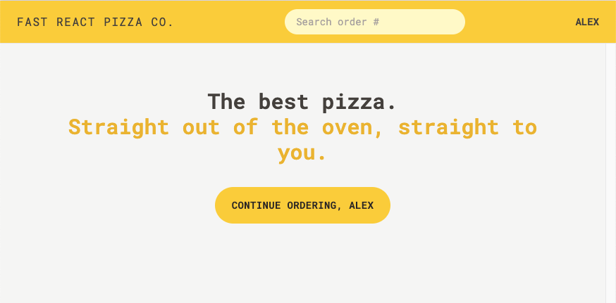
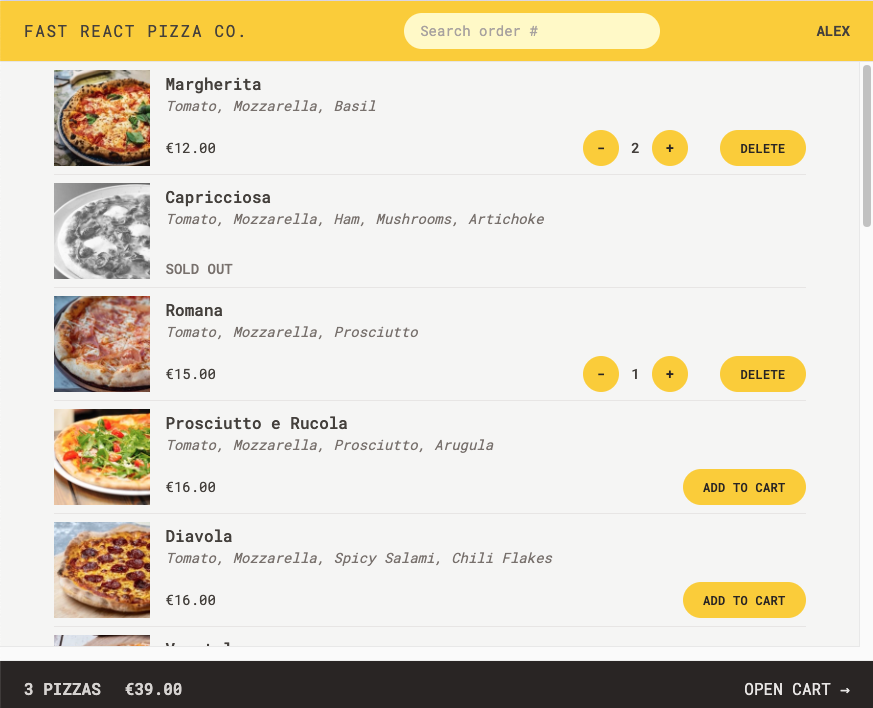
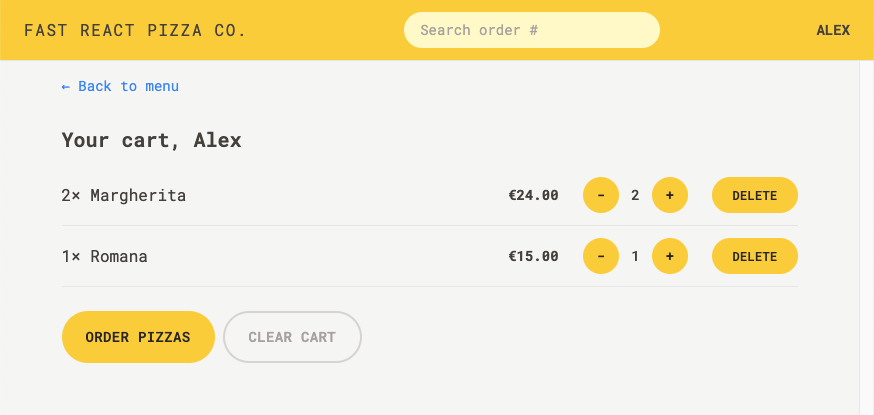

# Fast React Pizza (TypeScript)

## Tech Stack:

- React.js
- TypeScript
- Tailwindcss
- React Router
- Redux Toolkit

This project cover, how to implement React Router, use tailwindcss for styling and Redux for state managment.

These are screenshot of the pages:

### Home:

### Menu:

### Cart:

### Order:

### Finish Order:

